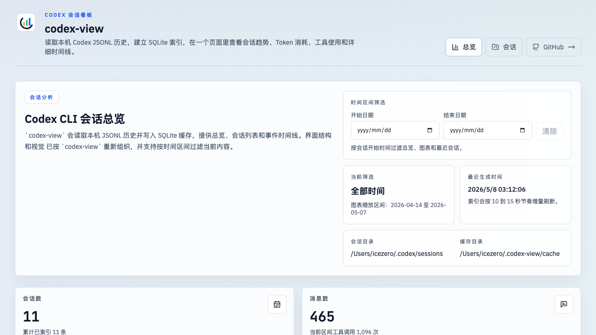
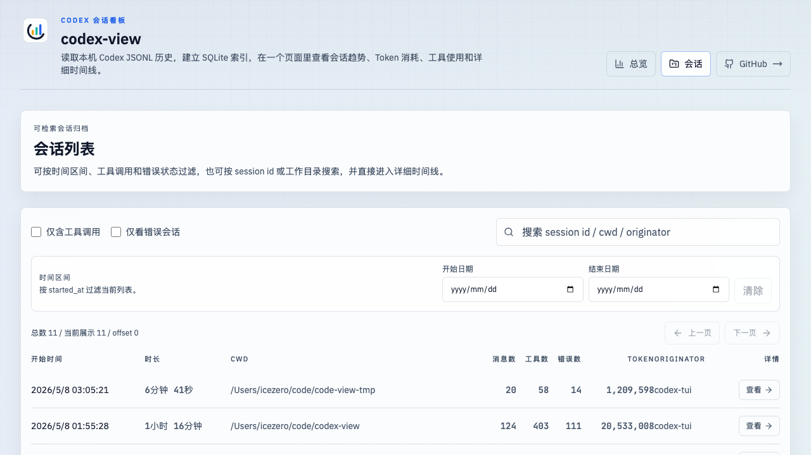
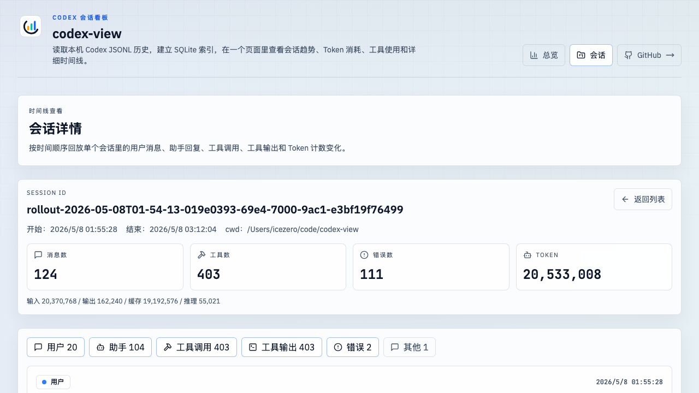

# codex-view

Codex CLI 会话可视化面板。

`codex-view` 会读取本机 `~/.codex/sessions` 下的 JSONL 历史，增量写入 SQLite 缓存，并提供总览、会话列表和事件时间线页面。

## 功能

- 总览面板：查看会话数、消息数、工具调用、错误数和 Token 趋势
- 时间区间筛选：按会话开始时间过滤总览和会话列表
- 会话列表：支持按 `session id`、`cwd`、`originator`、工具调用、错误状态筛选
- 时间线详情：查看用户消息、助手消息、工具调用、工具输出和 Token 计数

## 页面截图

以下截图基于本机 `~/.codex/sessions` 的真实数据生成。

### 总览页



### 会话列表页



### 会话详情页



## 本地运行

```bash
pnpm install
pnpm dev
```

默认使用 `http://127.0.0.1:3000`。

## 缓存目录

默认缓存目录为 `~/.codex-view/cache`，也可以通过 `CODEX_VIEW_CACHE_DIR` 覆盖。

## 全局安装

```bash
npm install -g codex-view
codex-view
```

默认会从 `3000` 端口开始找可用端口并启动服务，然后自动打开浏览器。
需要 `Node.js >= 20.9.0`。

可选参数：

```bash
codex-view --port 3200 --host 127.0.0.1
codex-view --sessions-dir ~/.codex/sessions --cache-dir ~/.codex-view/cache
codex-view --no-open
```
